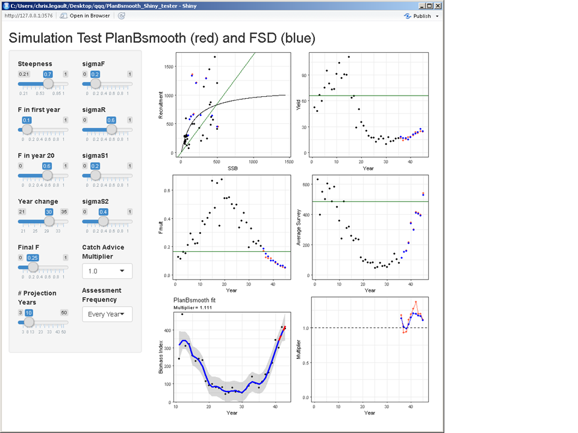

# PlanBsmooth_Shiny_tester
A Shiny app to test the PlanBsmooth package

* When run should look something like this

Controls for the simulation testing are:
* Steepness - determines the shape of the stock-recruitment relationship (shown in top left plot)
* F in first year - starting value for fishing mortality, linear change between this and F in year 20
* F in year 20 - fishing mortality in year 20, linear change between this and Final F in Year change
* Year change - fishing mortality flat between Year change and year 35 (end of base years)
* Final F - fishing mortality in years from Year change to year 35 (set sigmaF to 0 to see F in base years)
* Number of Projection Years - PlanBsmooth and FSD used in feedback loop to determine catch in projection years
* sigmaF - variability about F during first 35 years
* sigmaR - variability about stock-recruitment relationship in all years
* sigmaS1 - variability about first survey in all years
* sigmaS2 - variability about second survey in all years
+ Note that sigma values are applied as exp(base_value + rnorm * sigma - 0.5 * sigma * sigma)
* Catch Advice Multiplier - applies only to PlanBsmooth
* Assessment Frequency - catch held constant from previous value if no assessment in given year

In the plots, black dots indicate common values for both methods during base years (start at same point). Red dots show effect of applying PlanBsmooth to determine catch advice during projection years. Blue dots show effect of applying FSD to determine catch advice during projection years. Green solid lines show deterministic MSY related reference points. FSD uses default settings of Kp=0.75 and Kd=0.50 with 5 year time periods to determine slopes.
